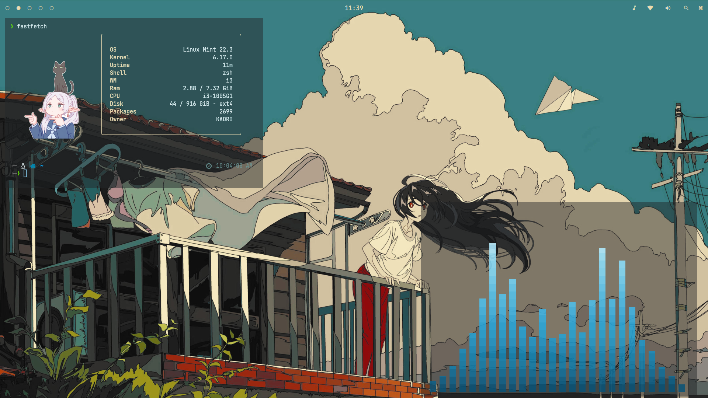

# updated-i3wm-dotfiles

My personal **i3wm dotfiles** for a lightweight, minimal, and highly customized Linux desktop.

Built around **i3wm**, with configurations for my window manager, status bar, application launcher, compositor, notifications, terminal, music visualizer, and system information.

## 📸 Preview



## 🧩 What's Included

| Component     | Purpose                                  |
| ------------- | ---------------------------------------- |
| **i3wm**      | Window manager                           |
| **Polybar**   | Status bar                               |
| **Rofi**      | Application launcher, menus & power menu |
| **Picom**     | X11 compositor                           |
| **Dunst**     | Notification daemon                      |
| **WezTerm**   | Terminal emulator                        |
| **Fastfetch** | System information                       |
| **Cava**      | Audio visualizer                         |

## 📁 Structure

```text
.
├── cava/
│   └── config
│
├── dunst/
│   └── dunstrc
│
├── fastfetch/
│   ├── config.jsonc
│   └── logo2.png
│
├── i3/
│   ├── config
│   ├── tree_tiler.py
│   └── scripts/
│       └── powermenu
│
├── picom/
│   └── picom.conf
│
├── polybar/
│   ├── config.ini
│   ├── launch.sh
│   └── scripts/
│       ├── network.sh
│       └── wifi-menu.sh
│
├── rofi/
│   ├── config.rasi
│   ├── music.rasi
│   ├── music.sh
│   ├── powermenu/
│   │   ├── type-1
│   │   ├── type-2
│   │   ├── type-3
│   │   ├── type-4
│   │   ├── type-5
│   │   └── type-6
│   ├── scripts/
│   │   └── music.sh
│   └── themes/
│       ├── black-outline.rasi
│       ├── black-outline.rasi.save
│       ├── catpuccin.rasi
│       └── papersky.rasi
│
├── wezterm/
│   └── wezterm.lua
│
├── 2326686.png
├── rice2.png
└── README.md
```

## ⚙️ Setup

These are personal dotfiles, so they are not intended to be a universal installer.

Clone the repository:

```bash
git clone https://github.com/rin1wav/updated-i3wm-dotfiles.git
cd updated-i3wm-dotfiles
```

Copy the configurations you want into your `~/.config` directory:

```bash
cp -r i3 ~/.config/
cp -r polybar ~/.config/
cp -r rofi ~/.config/
cp -r cava ~/.config/
cp -r dunst ~/.config/
cp -r fastfetch ~/.config/
cp -r wezterm ~/.config/
cp -r picom ~/.config/
```

> **Tip:** Back up your existing configurations before replacing them.

Some scripts may also need executable permissions:

```bash
chmod +x ~/.config/polybar/launch.sh
chmod +x ~/.config/polybar/scripts/*.sh
chmod +x ~/.config/i3/scripts/powermenu
```

## 🛠️ Requirements

The setup uses:

```text
i3
polybar
rofi
picom
dunst
wezterm
fastfetch
cava
```

Additional dependencies may be required by individual scripts or configurations depending on your system.

## 🎨 Philosophy

The setup is focused on keeping the desktop:

* Minimal
* Lightweight
* Clean
* Keyboard-driven
* Customizable

Instead of relying on a full desktop environment, the setup is built around **i3wm and lightweight utilities**.

## 📝 Notes

These configurations reflect my personal setup and may require modification depending on your:

* Linux distribution
* Hardware
* Display resolution
* Installed fonts
* Audio setup
* Preferred applications

Don't blindly copy everything into `~/.config`. Inspect the configurations and adapt them to your system.

## ⭐ Credits

Built and maintained by **rin1wav**.

Inspired by the Linux ricing and dotfiles community.

---

If you find these configs useful, feel free to ⭐ **star the repository**.
